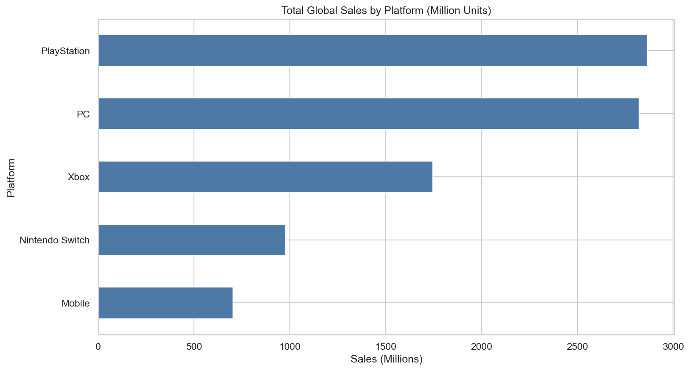
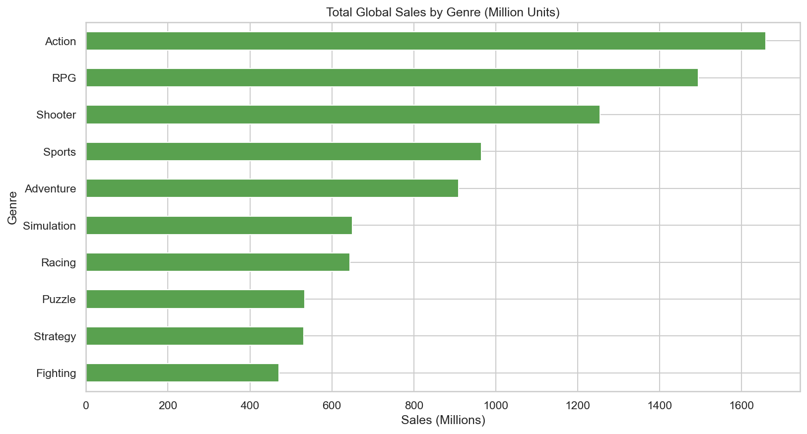
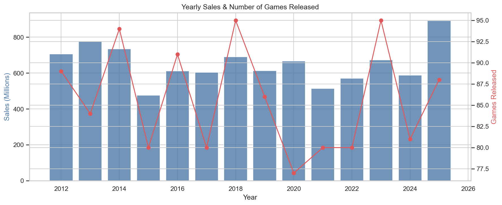
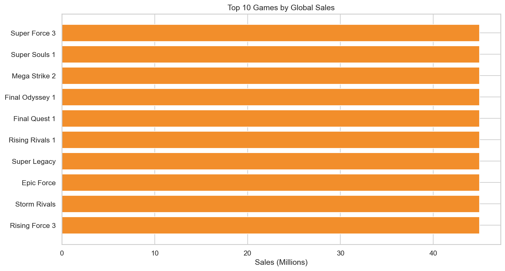

# 🎮 Gaming Sales & Player Behavior Analytics

End-to-end **Python-only** data analytics project that explores video game sales, ratings, genres, platforms, and player engagement using a clean modular code structure.

---

## 📌 Project Overview

This project analyzes 1,200 video games (2012–2025) to answer key questions related to global sales, critic and user scores, platform performance, genre trends, yearly releases, top games, publishers, and average playtime.

Unlike the other portfolio projects, this one uses **no SQL and no Power BI**.  
It is fully built with modular Python code to demonstrate clean project structure and pure Python analytics skills.

The complete pipeline follows:

**Load → Clean → Analyze → Visualize**

---

## 🛠️ Tools & Technologies

- **Python 3** – Core programming language
- **Pandas & NumPy** – Data manipulation
- **Matplotlib & Seaborn** – Charts and visual insights
- Modular project structure (`src/`, `data/`, `outputs/`, `notebooks/`)
- **Git & GitHub** – Version control and project showcase

---

## ✨ Key Features

- Overall summary metrics (total games, sales, average scores, playtime)
- Sales analysis by Platform and Genre
- Yearly release and sales trends
- Critic Score vs User Score comparison
- Top games and top publishers by sales
- Playtime distribution by genre
- Modular Python codebase (separate files for loading, cleaning, analysis, visualization)
- Exploratory Jupyter Notebook

---

## 📈 Key Insights

- PlayStation and PC lead in total global sales
- Action, RPG, and Shooter genres generate the highest revenue
- Critic and user scores are generally aligned across most genres
- Average playtime varies significantly by genre
- A small number of titles account for a large share of total sales
- Clear yearly patterns in game releases and sales

---

## 📁 Project Structure

```
Gaming-Sales-Player-Behavior-Analytics/
├── data/
│   ├── raw/
│   │   └── games_data.csv
│   └── processed/
│       └── games_cleaned.csv
├── src/
│   ├── __init__.py
│   ├── data_loading.py
│   ├── data_cleaning.py
│   ├── analysis.py
│   └── visualization.py
├── notebooks/
│   └── exploratory_analysis.ipynb
├── outputs/
│   └── charts/
├── main.py
├── requirements.txt
├── .gitignore
└── README.md
```

---

## 🚀 How to Run the Project

### 1. Install Dependencies
```bash
pip install -r requirements.txt
```

### 2. Run Full Pipeline
```bash
python main.py
```

This will:
- Load the raw dataset
- Clean and process the data
- Print key insights
- Generate and save all charts to `outputs/charts/`

### 3. Run Individual Modules (Optional)
```bash
python src/data_loading.py
python src/data_cleaning.py
python src/analysis.py
python src/visualization.py
```

### 4. Explore with Jupyter Notebook (Optional)
```bash
jupyter notebook notebooks/exploratory_analysis.ipynb
```

---

## 📊 Charts Generated

| File | Description |
|------|-------------|
| `01_sales_by_platform.png` | Total sales by platform |
| `02_sales_by_genre.png` | Total sales by genre |
| `03_yearly_trend.png` | Yearly sales and game releases |
| `04_score_distribution.png` | Critic and user score distributions |
| `05_critic_vs_user.png` | Critic vs user score scatter plot |
| `06_top_games_by_sales.png` | Top 10 games by global sales |
| `07_playtime_by_genre.png` | Playtime distribution by genre |
| `08_top_publishers.png` | Top publishers by sales |

---

## 🖼️ Screenshots

### Python Visualizations





---

## 👤 Author

**Mubeen Salman**  
Aspiring Data Analyst  

- LinkedIn: [https://www.linkedin.com/in/mubeen-salman-459776364/]  
- GitHub: [https://github.com/MuhammadMubeen04]  

---

## 📄 License

This project is for educational and portfolio purposes.
